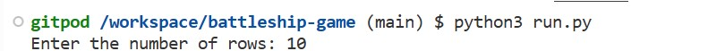
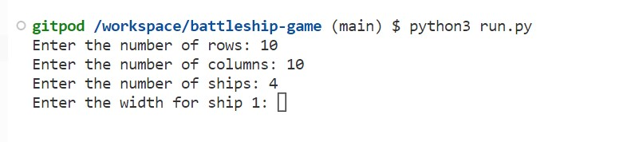
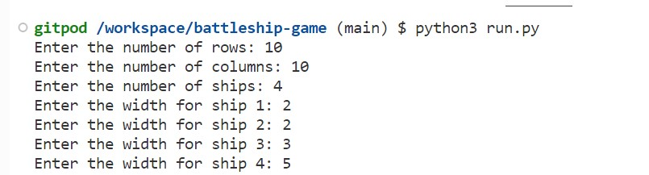
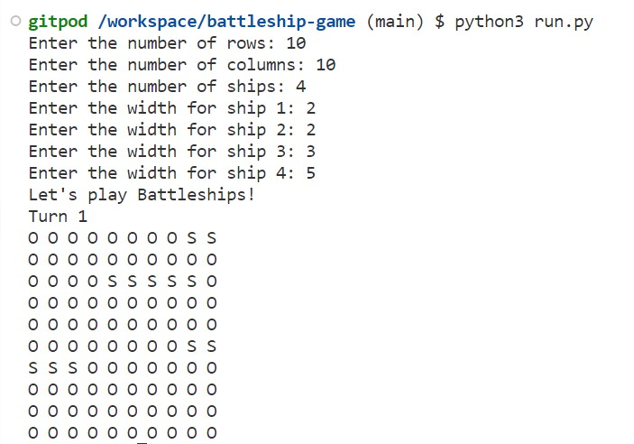
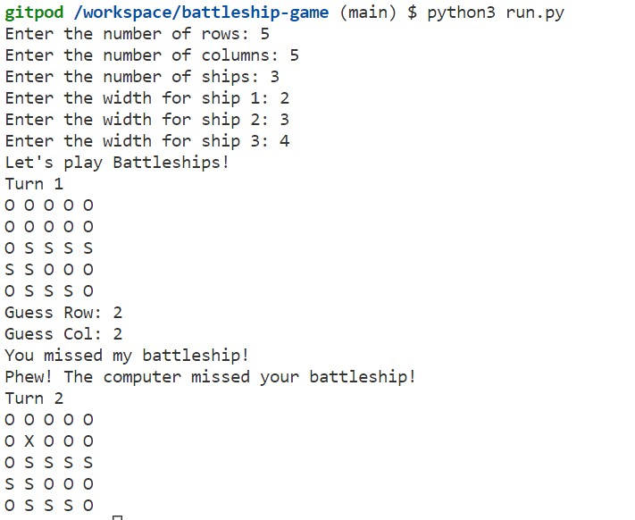
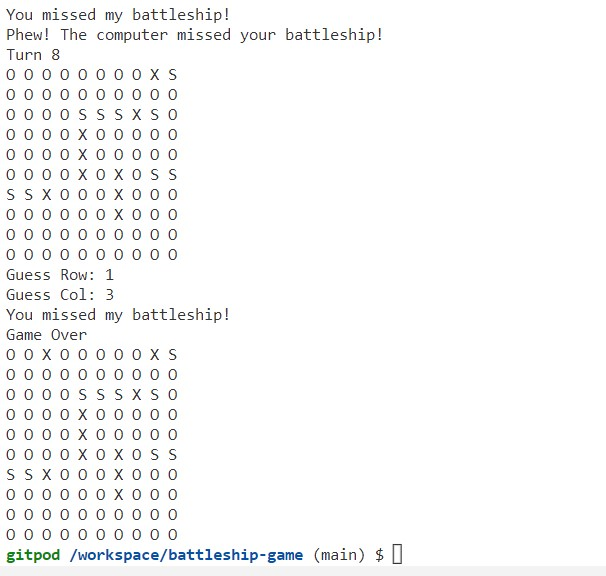
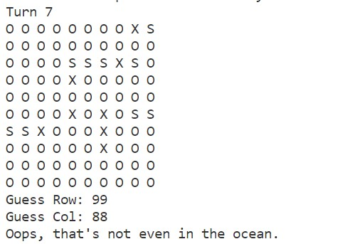

# Battleships-Game  

**Developer:** Anthony Raj

### The game is Battleships, a classic strategy game where the player's objective is to sink all the battleships hidden on a grid. Here's a breakdown of how the game works:

#### Setup:

- Players set up the game by specifying the number of rows and columns for the game board (maximum 20 each).
- They also determine the number of battleships to be placed on the board (maximum 5), along with the width of each battleship.

#### Game Information:

- Players are informed about the rules of the game:
    - They must sink all the battleships to win.
    - They have a limited number of turns to guess the positions of the battleships.
    - Each turn, they enter coordinates to guess where the battleships are hidden.

#### Gameplay:

- The game board is displayed, showing the ocean grid with coordinates.
- Players input coordinates to guess where the battleships are located.
- If a guess hits a battleship, it's marked as "X" on the grid.
- If a guess misses, it's marked as a "miss" on the grid.
- Players continue guessing until they either sink all the battleships or run out of turns.

#### Outcome:

- If the player sinks all the battleships within the allotted turns, they win.
- If they run out of turns before sinking all the battleships, they lose.

#### Legend:

- The legend explains the symbols used on the game board:
    - "O": Represents an empty cell or the ocean.
    - "X": Represents a hit or a sunk battleship.
    - "S": Represents a battleship.

#### Game Abortion:

- Players can abort the game at any time by using the keyboard interrupt (Ctrl + C).

**Overall, Battleships is a strategic guessing game that challenges players to use logic and deduction to locate and sink hidden battleships on the game board.**

**[View live website here](https://anthony-battleships-game.herokuapp.com/)**  :computer:

## Contents
- [Project Goals](#project-goals)
    - [User Stories](#user-stories)
    - [Site Owner Goals](#site-owner-goals)
- [User Experience](#user-experience)
    - [Target Audience](#target-audience)
    - [User Requirements and Expectations](#user-requirements-and-expectations)
    - [User Manual](#user-manual)
- [User Stories](#user-stories)
    - [Users](#users)
    - [Site Owner](#site-owner)
- [Teachnical Design](#technical-design)
    - [Flowchart](#flowchart)
- [Technology Used](#technology-used)
    - [Language used](#language-used)
    -[Python Libraries used](#python-libraries-used)
    - [Other websites/tools used](#other-websitestools-used)
    - [3rd Party Python Libraries used](#3rd-party-python-libraries-used)
- [Features](#features)
    - [Existing Features](#existing-features)
    - [Features to be implemented](#features-to-be-implemented)
- [Testing](#testing)
    - [Manual Testing](#manual-testing)
    - [Tested Devices with Browsers](#tested-devices-with-browsers)
    - [Validator Testing](#validator-testing)
    - [Bugs and Fixes](#bugs-and-fixes)
    - [Unfixed Bugs](#unfixed-bugs)
- [Deployment](#deployment)
    - [Deploying in Heroku](#deploying-the-website-in-heroko)
    - [Forking the GitHub Repository](#forking-the-github-repository)
    - [Cloning of Repository i GitHub](#cloning-the-repository-in-github)
- [Credits](#credits)
    - [Content](#content)
    - [Code](#code)
- [Thank You](#thank-you)

## Project Goals
### User Stories

#### 1. As a Battleships Player (External User):
- I want to play a logic game where I can challenge myself.
- I want to be able to set the grid size to adjust the complexity of the game.
- I want to receive warnings if my guess is off-grid.

### Site Owner Goals

#### 2.Provide a Functional Battleships Game:
- Offer a fully functional Battleships game where players can play against the computer.
- Allow players to customize the game grid size and number of ships to enhance gameplay flexibility.
- Ensure the game operates smoothly and provides clear instructions to the players.

## User Experience
### Target Audience

- There is no specific audience for the game. 
- Individuals who enjoy logic-based games and strategic thinking.
- Players looking for a single-player gaming experience.

### User Requirements and Expectations

1. Customizable Grid Size:
- Users should be able to set the number of rows and columns for the game grid.
2. Variable Number of Ships:
- Users should be able to specify the number of ships they want to play with.
- Each ship can have a different width, allowing for varied challenges.
3. Interactive Gameplay:
- Users expect an interactive gameplay experience where they can input their guesses for ship positions.
- They expect feedback on the success or failure of their guesses.
4. Clear Instructions and Error Handling:
- Users expect clear instructions on how to play the game.
- They expect the system to handle errors gracefully, such as invalid input or out-of-grid guesses.

### User Manual

Click here to view instructions

#### Starting the Game:
- Users launch the game and are greeted with a welcome message and game information.
- They set up the game parameters by specifying the grid size and number of ships.
#### Gameplay:
- Users take turns guessing the positions of the ships by inputting row and column coordinates.
- The system provides feedback on whether the guess was successful or not.
- Users continue guessing until they either sink all the ships or run out of turns.
#### Ending the Game:
- The game ends when all ships are sunk or when the user runs out of turns.
- Users receive appropriate messages indicating the outcome of the game.
#### Error Handling:
- Users are guided with error messages if they input invalid parameters or make incorrect guesses.
- They can abort the game at any time by using keyboard shortcuts.

...........................................................................................................................

# Battleships-Game 

 - Ultimate Battleships is a Python terminal game, which runs in the Code Institute mock terminal on Heroku

 - The code provided is a simplified version of the Battleship game. Here's a short summary of what the code does:

1. It imports the random module for generating random numbers.
2. It defines several functions:
   - Creates a game board with dimensions rows x cols and initializes all cells with "O".
   - Prints the game board.
   - Randomly places battleships on the board according to the specified ship widths.
   - Checks if a guess is within the bounds of the game board.
   - Takes user input for a guess (row and column) and checks if it is a valid guess.
   - The game loop continues until the game is over.

Overall, this code sets up and plays a simplified version of the Battleship game where the player and computer take turns guessing coordinates on the game board to sink each other's battleships.

 - Here is the live version of my project. [battleships-game](https://anthony-battleships-game.herokuapp.com/)

## How to Play

1. Run the code in a Python environment.
2. Enter the number of rows for the game board when prompted.

3. Enter the number of columns for the game board when prompted.

4. Enter the number of ships you want to play with when prompted.

5. For each ship, enter the width of the ship when prompted.

6. The game board will be displayed with ships randomly placed on it.

7. The game begins, and you and the computer take turns guessing the locations of each other's 
   battleships.
8. When it's your turn, enter the row and column you want to guess.

9. If your guess hits an opponent's battleship, you will be notified, and the battleship will be 
   marked as sunk on the game board.
10. If your guess misses, you will be notified, and the corresponding position on the game board 
    will be marked as 'X'.

11. The computer will take its turn and follow the same rules.
12. The game continues until either all the battleships are sunk or the maximum number of turns is 
    reached.
13. At the end of the game, the final game board will be displayed along with the game over message.

Have fun playing Battleships!

## Features
-----------------------------------------------------------------------------------------
## Existing Features

- Creating the game board: The create_battleship_board function creates a game board with the specified number of rows and columns.

- Printing the game board: The print_battleship_board function displays the current state of the 
  game board.

- Placing battleships on the board: The place_ships_on_the_board function randomly places 
  battleships on the game board based on the specified number of ships and their widths.

- Checking if a guess is on the board: The is_on_board function checks if the user's guess is       within the boundaries of the game board.

- Getting the user's guess: The get_guess_from_player function prompts the user to enter their  
  guess for the row and column.

- Playing the game: The code implements the main game loop where the player and the computer take 
  turns guessing the locations of the battleships. The result of each guess is displayed, and the game ends when all ships have been sunk or the maximum number of turns is reached.

Overall, the code allows users to play a basic version of the Battleships game against the computer.

## Future Features

- Player customization: Allow players to choose their own symbols for ships, hits, misses, and the 
  ocean. This customization can add a personal touch to the game.

- Difficulty levels: Implement different difficulty levels, such as easy, medium, and hard. 
  Each level can have varying board sizes, ship widths, and AI strategies, providing a different level of challenge to players.

- Multiplayer mode: Enable a multiplayer mode where two players can compete against each other on 
  separate devices or over a network. This could involve implementing a turn-based system and a way for players to input their guesses.

- Score tracking and leaderboard: Implement a scoring system to track players' performance and 
  maintain a leaderboard. This can add a competitive element to the game and encourage replayability.

## Data Model

The data model in the provided code is relatively simple and consists of a two-dimensional list representing the game board. Each element in the list represents a cell on the board and can have one of the following values:

"O": Represents an empty cell or the ocean.

"S": Represents a battleship.

"X": Represents a hit or a sunk battleship.

- The board variable is created using the create_battleship_board function, which initializes a  
  two-dimensional list with the specified number of rows and columns, filled with "O" values.

- The battleships are randomly placed on the board using the place_ships_on_the_board function. It 
  iteratively selects random coordinates on the board and checks if there is enough space to place a ship with the specified width. If the location is valid, it updates the cells with "S" values to represent the battleships.

During the game, the board is printed using the print_battleship_board function, which displays the current state of the board.

- The user's guesses and the computer's guesses are recorded by modifying the elements of the board 
  list. If the guess corresponds to a battleship ("S"), it is marked as a hit ("X"). Otherwise, it is marked as a miss ("X").

Overall, the data model primarily revolves around manipulating the elements of the board list to represent the state of the game and track the positions of the battleships and the guesses made by the player and the computer.

## Testing 

I have manually tested this project by doing the following:
-  Passed the code through a PEP8 linter and confirmed there are no problems
-  Given invalid inputs: Out of bounds inputs, same input twice
-  Tested in my local terminal and the Code Institute Heroku terminal
-  Follow the prompts to enter the number of rows, columns, number of ships, and ship widths.
-  Play the game by entering your guesses for row and column coordinates when prompted.
-  Observe the output, which will show the game board, messages indicating whether you hit or  
   missed a battleship, and the final state of the game board.
-  Continue playing until the sunk or game ends.

## Bugs 

- No bugs found

## Validator Testing 

- PEP8 -- No errors were returned from PEP8online.com

## Deployment 

This project was deployed using Code Institute's mock terminal for Heroku.

Steps for deployment:
- Fork or clone this repository
- Create a new Heroku app
- Set the build backs to Python and NodeJS in that order
- Link the Heroku app to the repository
- Click on Deploy

## Credits 

- Code Institute for the deployment terminal
- Wikipedia for the details of the Battleships game
- How to play the Battleships game know the information from youtube 
